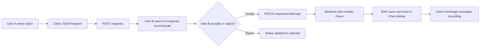

# SyncUp — Full Project Documentation

> **AI-Powered Student Collaboration Platform**  
> Last updated: April 2026

---

## Table of Contents

1. [Project Overview](#1-project-overview)
2. [Tech Stack](#2-tech-stack)
3. [Project Structure](#3-project-structure)
4. [Backend — FastAPI](#4-backend--fastapi)
5. [Frontend — React + TypeScript](#5-frontend--react--typescript)
6. [Privacy-Focused Collaboration Flow](#6-privacy-focused-collaboration-flow)
7. [Database Schema](#7-database-schema)
8. [API Reference](#8-api-reference)
9. [UI Design System](#9-ui-design-system)
10. [How to Run the Project](#10-how-to-run-the-project)

---

## 1. Project Overview

**SyncUp** is an AI-powered student collaboration platform that intelligently connects students for hackathons, capstone projects, open-source contributions, and side-hustles — without requiring them to share any personal contact info.

### Core Goals
- Match students using **ML-based cosine similarity + weighted scoring** across skills, interests, availability, and work style.
- Allow students to find teammates for their own skillset **or** find suitable candidates for their posted projects.
- Enable **privacy-first collaboration** — no phone numbers or social links shared. Everything happens via in-app requests and chat rooms.

---

## 2. Tech Stack

| Layer | Technology |
|---|---|
| **Backend Framework** | FastAPI (Python) |
| **Database** | MongoDB Atlas (Cloud) |
| **Auth** | JWT tokens (OAuth2 Password Flow) |
| **ML Matching** | Cosine Similarity + Custom Scoring (`matcher.py`) |
| **Frontend** | React + TypeScript + Vite |
| **Routing** | React Router v6 |
| **Styling** | Vanilla CSS with Custom Design Tokens |
| **HTTP Client** | Axios |

---

## 3. Project Structure

```
teammate-matcher/
├── app/                        # Backend (FastAPI)
│   ├── main.py                 # App entry point, CORS setup
│   ├── auth.py                 # JWT authentication helpers
│   ├── db.py                   # MongoDB Atlas client + 5 collections
│   ├── models.py               # Pydantic schemas (all data models)
│   ├── matcher.py              # ML matching algorithms
│   └── routes.py               # All API endpoints
│
├── frontend/                   # Frontend (React + Vite)
│   └── src/
│       ├── api/                # Axios API service files
│       │   ├── profiles.ts
│       │   ├── projects.ts
│       │   ├── matches.ts
│       │   └── collaboration.ts   # ← New: Requests, Rooms, Messages
│       ├── components/
│       │   ├── layout/
│       │   │   ├── Navbar.tsx
│       │   │   └── PageWrapper.tsx
│       │   ├── match/
│       │   │   └── ScoreRing.tsx
│       │   └── ui/             # Reusable UI: Button, Badge, Input, Loader
│       ├── hooks/
│       │   └── useAuth.tsx     # JWT auth state management
│       ├── pages/
│       │   ├── Landing.tsx     # Home page
│       │   ├── Auth.tsx        # Login / Register
│       │   ├── Dashboard.tsx   # Stats overview
│       │   ├── Profile.tsx     # Edit ML profile
│       │   ├── FindTeammates.tsx   # ML teammate matches
│       │   ├── FindProjects.tsx    # ML project matches
│       │   ├── MyProjects.tsx      # Create & manage projects
│       │   ├── Requests.tsx        # ← New: Incoming/Sent requests
│       │   └── Chat.tsx            # ← New: Private chat rooms
│       ├── styles/
│       │   └── globals.css     # Full design system / CSS tokens
│       ├── types/              # TypeScript interfaces
│       └── utils/              # Constants, helpers
│
└── .env                        # Environment vars (MONGO_URI, JWT secrets)
```

---

## 4. Backend — FastAPI

### `auth.py`
Handles JWT-based authentication:
- `get_password_hash()` — bcrypt hashing
- `verify_password()` — login check
- `create_access_token()` — generates JWT with expiry
- `get_current_user()` — FastAPI dependency, extracted from Bearer token

### `db.py`
Connects to **MongoDB Atlas** and exposes 5 collection references:

| Collection | Purpose |
|---|---|
| `profiles_collection` | User profiles and skills |
| `projects_collection` | Posted project listings |
| `requests_collection` | Collaboration requests (send/accept/reject) |
| `rooms_collection` | Private chat rooms between accepted users |
| `messages_collection` | Individual chat messages in a room |

### `models.py`
All Pydantic schemas:

```
ProfileCreate / ProfileOut       → User profile & skills
ProjectCreate / ProjectOut       → Project listing  
CollaborationRequestCreate/Out   → Request lifecycle
RoomCreate / RoomOut             → Chat rooms
MessageCreate / MessageOut       → Chat messages
Token / TokenData                → JWT auth
```

### `matcher.py`
The ML engine powering teammate and project matching:
- **Teammate matching**: Cosine similarity over skill vectors + bonuses for shared interests, compatible work styles, and matching availability.
- **Project matching**: Scores a candidate's skills against a project's `required_skills`, with bonuses for domain interest overlap.

---

## 5. Frontend — React + TypeScript

### Pages

| Page | Route | Purpose |
|---|---|---|
| Landing | `/` | Hero page with feature highlights and stats |
| Auth | `/auth` | Login and register form |
| Dashboard | `/dashboard` | Overview cards, quick nav |
| Profile | `/profile` | Edit name, bio, skills, interests, availability |
| Find Teammates | `/find-teammates` | ML-ranked match cards, send request in one click |
| Find Projects | `/find-projects` | ML-ranked project match cards |
| My Projects | `/projects` | Create, view and manage your own project postings |
| **Requests** | `/requests` | **Incoming** / **Sent** collaboration requests with Accept/Reject |
| **Chat** | `/chat` | Private chat rooms with accepted collaborators |

### Key Reusable Components

| Component | Location | Description |
|---|---|---|
| `Navbar` | `components/layout` | Sticky nav with gradient logo, active route, user avatar |
| `PageWrapper` | `components/layout` | Consistent page container with title, subtitle, back button |
| `Button` | `components/ui` | Primary / Secondary / Ghost / Danger variants |
| `Badge` | `components/ui` | Inline label for skills, status, request types |
| `Input / Select` | `components/ui` | Themed form inputs |
| `Loader / SkeletonCard` | `components/ui` | Loading states |

### Key Hooks

- **`useAuth()`** — reads JWT from `localStorage`, exposes `userId`, `isLoggedIn`, `logout()`

---

## 6. Privacy-Focused Collaboration Flow

This is the major feature added to the original skeleton. The full lifecycle is:



### Deduplication
On the client side in `Chat.tsx`, rooms are deduped by a composite key of `project_id + sorted(members)` to prevent race-condition duplicate rooms appearing in the sidebar.

---

## 7. Database Schema

### `requests` Collection
```json
{
  "request_id": "uuid",
  "sender_id": "user_id string",
  "receiver_id": "user_id string",
  "request_type": "teammate | project_join",
  "project_id": "optional string",
  "message": "optional string",
  "status": "pending | accepted | rejected",
  "created_at": "datetime"
}
```

### `rooms` Collection
```json
{
  "room_id": "uuid",
  "members": ["user_a_id", "user_b_id"],
  "project_id": "optional string",
  "created_at": "datetime"
}
```

### `messages` Collection
```json
{
  "message_id": "uuid",
  "room_id": "uuid",
  "sender_id": "user_id string",
  "text": "string",
  "timestamp": "datetime"
}
```

---

## 8. API Reference

### Auth
| Method | Endpoint | Description |
|---|---|---|
| `POST` | `/token` | Login, returns JWT |

### Profiles
| Method | Endpoint | Auth | Description |
|---|---|---|---|
| `POST` | `/profile` | No | Register a new user |
| `PUT` | `/profile` | ✅ | Update current user's profile |
| `GET` | `/profiles` | No | List all profiles (paginated) |

### Matching
| Method | Endpoint | Auth | Description |
|---|---|---|---|
| `GET` | `/match/{user_id}` | ✅ | Get ML teammate matches |
| `GET` | `/project-match/{project_id}` | ✅ | Get ML project candidate matches |

### Projects
| Method | Endpoint | Auth | Description |
|---|---|---|---|
| `POST` | `/project` | No | Create a project |
| `GET` | `/projects` | No | List all projects |

### Collaboration Requests
| Method | Endpoint | Auth | Description |
|---|---|---|---|
| `POST` | `/requests` | ✅ | Send a collaboration request |
| `GET` | `/requests/incoming` | ✅ | View requests sent to you |
| `GET` | `/requests/sent` | ✅ | View requests you sent |
| `PATCH` | `/requests/{id}/accept` | ✅ | Accept → auto-creates chat room |
| `PATCH` | `/requests/{id}/reject` | ✅ | Reject a request |

### Rooms & Messaging
| Method | Endpoint | Auth | Description |
|---|---|---|---|
| `GET` | `/rooms` | ✅ | List all rooms for current user |
| `GET` | `/rooms/{id}` | ✅ | Get room details |
| `GET` | `/rooms/{id}/messages` | ✅ | Get all messages in a room |
| `POST` | `/rooms/{id}/messages` | ✅ | Send a message |

---

## 9. UI Design System

Located in `frontend/src/styles/globals.css`.

### The "Aurora" Color Theme

| Variable | Value | Use |
|---|---|---|
| `--bg-color` | `#070410` | Page background (deep midnight) |
| `--bg-surface` | `#0E0A1F` | Cards, panels |
| `--bg-surface-hover` | `#16102D` | Hover states |
| `--accent-cyan` | `#00F0FF` | Primary highlights, active states |
| `--accent-blue` | `#2B6AFF` | Buttons, links |
| `--accent-pink` | `#FF007F` | Gradients, CTA |
| `--accent-purple` | `#8A2BE2` | Borders, glows |
| `--accent-green` | `#00FF87` | Success states |
| `--accent-gradient` | `cyan → pink` | Sent messages, primary CTA |
| `--accent-complex` | `cyan → blue → purple → pink` | Logo |
| `--text-primary` | `#FFFFFF` | Main text |
| `--text-secondary` | `rgba(255,255,255, 0.7)` | Subtext |
| `--glass-bg` | `rgba(14,10,31,0.65)` | Glassmorphism panels |
| `--shadow-glow` | `0 0 24px rgba(0,240,255,0.3)` | Neon card glow |

### Key Design Patterns
- **Glassmorphism**: `backdrop-filter: blur(32px)` on all `.glass-panel` surfaces
- **Neon Glows**: Top match cards emit a purple glow via `box-shadow`
- **Text Gradients**: `.text-gradient` class applies the cyan→pink sweep to headings
- **Ambient Orbs**: Landing hero has two large blurred cyan and pink radial orbs behind the content
- **Hover Animations**: Feature cards shift shadow to `--shadow-glow` on hover

---

## 10. How to Run the Project

### Backend
```bash
# From project root
pip install -r requirements.txt   # if first time
uvicorn app.main:app --reload --port 8000
```
Backend runs at: `http://localhost:8000`  
Auto-docs: `http://localhost:8000/docs`

### Frontend
```bash
cd frontend
npm install    # if first time
npm run dev
```
Frontend runs at: `http://localhost:5173`

### Environment Variables (`.env` in root)
```env
MONGO_URI=mongodb+srv://<user>:<password>@<cluster>.mongodb.net/<db>
SECRET_KEY=your_jwt_secret_key
```

> [!TIP]
> When running locally, make sure your MongoDB Atlas cluster has your current IP address whitelisted in the **Network Access** settings.

> [!NOTE]
> The chat system uses **polling every 3 seconds** to fetch new messages. For a production upgrade, consider switching to **WebSockets** for true real-time messaging.
